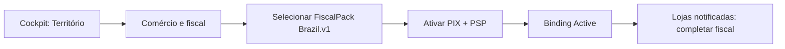

# Pacotes fiscais & meios de pagamento por território

**Versão**: 1.0  
**Data**: 2026-08-15  
**Status**: Proposta de produto (âncora FASE62 + FASE55/57)  
**Público**: produto, implementador, UX, engenharia  

> Princípio Arah: **Territory é geográfico e neutro**. Configuração fiscal e de meios de pagamento vive em entidades **escopadas por `territoryId`**, nunca como campos sociais/fiscais embutidos em `Territory`.

---

## 1. Ideia central

Cada território pode ativar, de forma independente:

1. **Meios de pagamento** (ex.: PIX, cartão via PSP X, boleto)  
2. **Pacote fiscal / “inspeção”** (regras de KYC, documentos, emissão de NF do país/regime)

A **primeira versão** do pacote fiscal é só **Brasil** (`FiscalPack.Brazil.v1`). Outros países entram depois como novos packs pluggáveis — o implementador escolhe o pack aplicável ao território que opera.

```text
Implementador
    │  ativa no território
    ├─► PaymentMethodsConfig  (quais meios, PSP, chaves de ambiente)
    └─► FiscalPackBinding     (ex.: Brazil.v1)
              │
              ▼
         Comerciantes passam a ver
         jornada KYC/fiscal + gates
              │
              ▼
         Compradores veem só o necessário
         (meios disponíveis + comprovantes)
```

---

## 2. Papéis e o que cada um vê

| Papel | Onde configura / age | O que vê | O que **não** vê |
|-------|----------------------|----------|------------------|
| **Implementador** (“planter”) | Cockpit (FASE57) → Território → **Comércio & fiscal** | Ativar pack BR; meios de pagamento; status KYC das lojas; export operacional; split/receita open-core | Dados pessoais de moradores sem necessidade; “investimento” genérico sem base legal |
| **Comerciante** (dono da Store) | App → **Minha loja** (não o perfil social) | Cadastro fiscal (CNPJ/MEI), PixKey, status KYC, notas emitidas, saldo/payout | Config do pack do território; secrets do PSP |
| **Morador / comprador** | Checkout + histórico de pedidos | Meios de pagamento **ativos** no território; comprovante de compra; link da NF **se** o pack emitir e a loja estiver apta | CNPJ de outras lojas; fila KYC; cockpit |
| **Curador** | Moderação / governança | Apenas o que a governança local definir (ex.: votar taxa open-core FASE56) — **não** substitui KYC fiscal | Aprovar NF ou alterar pack (salvo regra futura explícita) |

**Perfil do usuário (`/me`)**: identidade, membership, preferências — **não** é o lugar do cadastro fiscal completo. No máximo um atalho: “Sua loja precisa completar dados fiscais” → Minha loja.

---

## 3. Configuração do território (implementador)

### 3.1 Tela sugerida — Cockpit: “Comércio & fiscal”

Passos (MVP BR):

1. **Escolher pacote fiscal** — lista de packs disponíveis na instância (`Brazil.v1` único no MVP).  
2. **Confirmar município / UF de referência operacional** (para ISS/NFS-e) — metadado do *binding*, não do polígono Territory.  
3. **Ativar meios de pagamento** — checkboxes: PIX (obrigatório no MVP BR), outros “em breve”.  
4. **Conectar PSP** (sandbox/prod) — status da chave; sem colar secret na UI do app morador.  
5. **Ligar o pacote** — `status: Active` → comerciantes passam a ser *exigidos* a completar KYC antes de vender.

Desligar o pack (se permitido): lojas já aprovadas entram em modo “somente leitura / sem novas vendas” conforme política — documentar no spec.

### 3.2 Modelo de dados (conceitual)

| Entidade | Escopo | Conteúdo |
|----------|--------|----------|
| `TerritoryPaymentMethodsConfig` | `territoryId` | métodos habilitados, pspProvider, flags |
| `TerritoryFiscalPackBinding` | `territoryId` | `packId` (ex. `brazil.v1`), `status`, `activatedByImplementerId`, `activatedAt`, params (município IBGE…) |
| `FiscalPackDefinition` | catálogo da instância | id, country, capabilities (kyc, nfse, regimes) |
| `MerchantFiscalProfile` | `storeId` | já previsto em FASE62.a |

**Territory** continua só com geo/nome/status — sem CNPJ, sem pack embutido.

---

## 4. Dinâmica das jornadas

### 4.1 Implementador — ativar Brasil no território



**Resultado**: feature efetiva “comércio formal BR” ligada **só naquele território**.

### 4.2 Comerciante — Minha loja (após pack ativo)

1. Banner: “Este território exige dados fiscais BR para vender.”  
2. Formulário: tipo (MEI/CNPJ), documento, razão social, município, regime.  
3. PixKey + (futuro) conta payout.  
4. Status: `Draft → Submitted → Approved | Rejected`.  
5. Só com `Approved` + assinatura comercial: `paymentsEnabled` / publicar items.  
6. Pós-venda (62.b): ver NF emitida / pendente; baixar PDF/XML.

### 4.3 Comprador — checkout

1. Vê apenas meios **ativos** no config do território (ex.: PIX).  
2. Quote mostra **taxa open-core** (já FASE55) — linha separada de qualquer imposto.  
3. Se NF existir: “Nota fiscal” no comprovante do pedido (não no feed social).

### 4.4 “Gerar renda / investimento”?

| Conceito | No Arah hoje / proposto |
|----------|-------------------------|
| **Renda do comerciante** | Vendas − taxa; saldo SellerBalance / Wallet; payout — **já na trilha FASE55/7** |
| **Renda do implementador** | Share do split (`implementer`) — **já no FeeSplitRule**; cockpit FASE57 mostra consolidado |
| **Fundo do território** | Share `territory_fund` — transparência FASE56 |
| **“Investimento” / capital** | **FASE61** (capital territorial) — **não** misturar com pacote fiscal BR; NF de doação ≠ NF de venda |

O pacote fiscal **não cria** produto de investimento. Ele **formaliza** quem já vende e quem já recebe split — para o piloto não operar na informalidade.

---

## 5. UX — onde fica cada coisa (app + cockpit)

| Superfície | Conteúdo fiscal / pagamento |
|------------|-----------------------------|
| **Cockpit → Território → Comércio & fiscal** | Ativação do pack, meios, status agregado KYC, export |
| **App → Minha loja** | Cadastro fiscal, PixKey, status, NFs, saldo |
| **App → Perfil** | Atalho/alerta se loja incompleta; sem formulário fiscal pesado |
| **App → Checkout / Pedidos** | Meios + comprovante + link NF |
| **App → Governança** | Só taxas open-core (FASE56), não KYC |

Tom: baixa excitação; copy de cuidado (“dados usados para emitir documentos e receber pagamentos”), sem alarmismo.

---

## 6. Relação com FASE62 e pagamentos

| Fatia | O que entrega neste modelo |
|-------|----------------------------|
| **62.0** (novo, config) | Catálogo de packs + `TerritoryFiscalPackBinding` + `TerritoryPaymentMethodsConfig` + UI implementador |
| **62.a** | Perfil/KYC comerciante + gates quando binding BR ativo |
| **62.b** | NFS-e quando pack BR + perfil aprovado |
| **62.c** | Retenção/export |
| **FASE55** | Quote/split/PIX real — consome payment methods do território |
| **FASE57** | Shell do cockpit para a tela de config |
| **FASE60** | Atalhos leves no app do implementador |

MVP sugerido: **62.0 + 62.a** juntos no primeiro PR de produto; 62.b depois.

---

## 7. Extensibilidade (depois do BR)

```text
FiscalPack.Brazil.v1     ← MVP
FiscalPack.Portugal.v1   ← futuro (exemplo)
FiscalPack.None          ← território só comunitário, sem comércio formal
```

Ativar pack errado para a jurisdição = bloqueado por validação (país do pack vs política da instância) + confirmação humana do implementador.

---

## 8. Critérios de aceite (produto — rascunho)

- [ ] Implementador ativa `Brazil.v1` **por território** sem alterar a entidade Territory  
- [ ] Território sem pack ativo: comércio pode seguir regras atuais (ou bloqueio configurável — decidir no spec)  
- [ ] Com pack ativo: comerciante vê jornada em Minha loja; perfil só alerta  
- [ ] Comprador só vê meios habilitados naquele território  
- [ ] Split/receita open-core separado visualmente de documentos fiscais  
- [ ] Nenhum fluxo de “investimento” acoplado ao pack fiscal  

---

## Referências

- [ANALISE_FISCAL_BR.md](./ANALISE_FISCAL_BR.md)  
- [FASE62.md](../backlog-api/FASE62.md)  
- [FASE55.md](../backlog-api/FASE55.md) · [FASE57.md](../backlog-api/FASE57.md) · [FASE61.md](../backlog-api/FASE61.md)  
- ADR implícito: Territory neutro (`.cursorrules` / ADR-003)  
