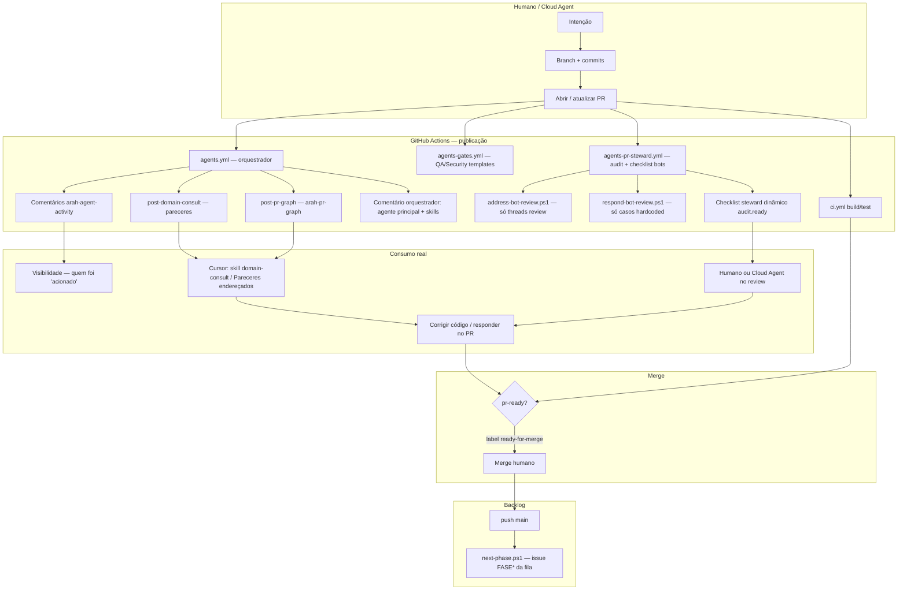

# Integridade do fluxo de agentes no PR

**Versão**: 1.1  
**Data**: 2026-08-15  
**Público**: produto, engenharia, operação por agentes  
**Status**: diagnóstico + **P0/P1 implementados** (filtro steward, pareceres no template, `arah-pr-graph`, checklist dinâmico)

---

## 1. Resposta curta

| Pergunta | Resposta |
|----------|----------|
| Onde os comentários dos “agentes” são consumidos? | Principalmente por **humano** e por **agente de código** (Cursor/Cloud) que **escolhe** ler o PR / `domain-review.md` / skill `arah-domain-consult`. **Não** há loop automático que marca checklists de domínio. |
| O Agent Graph aparece no PR? | **Sim (P1):** comentário `<!-- arah-pr-graph -->` via `post-pr-graph.ps1` no Orchestrate. O grafo estático do repo continua em `export-graph` → JSON. |
| Os agentes de domínio “agem”? | No CI eles são **consultivos**: colam parecer + checklist “Validar no PR” a partir do YAML. **Não executam código.** Consumo explícito = seção **Pareceres endereçados** no corpo do PR. |
| Por que parece que “anotam e não fazem”? | Porque o desenho atual é **passivo por arquivo + comentário** (sem `followup_message` / sem segundo turno de modelo no hook). Publicar ≠ cumprir — o executor continua sendo humano/Cloud Agent. |

---

## 2. Fluxo completo (criação → evolução → merge)



### O que cada comentário **é**

| Marcador no PR | Origem | Natureza |
|----------------|--------|----------|
| `arah-orchestrator` | `agents.yml` | Roteamento: agente principal + skills **sugeridas** |
| `arah-pr-graph` | `post-pr-graph.ps1` | Vista do roteamento desta revisão (agentes, skills, domínios, rules) |
| `arah-agent-activity:*` | `post-agent-activity.ps1` | “Agente X foi acionado” + checklist de **conduta** (guardrails do manifesto) |
| `arah-domain-consult:*` | `post-domain-consult.ps1` | Texto fixo do `enrich`/`validate` do `.agents/domain/*.agent.yaml` + lista de arquivos do diff |
| `arah-qa-gate` / security | `agents-gates.yml` | Template de checklist orientativo |
| `arah-pr-steward` | `agents-pr-steward.yml` | Checklist dinâmico (CI/threads auto-ticados quando `audit.ready`) |
| CodeRabbit / Bugbot | SaaS externo | Review inline (quando PR não é draft) |
| Resposta `cursor` / humano | Agente de código ou pessoa | **Único** lugar onde checklists de domínio costumam ser *respondidos* de fato |

---

## 3. Agent Graph — o que é e como “apresentar”

- Formaliza arestas: path → regra → agente → skill → spec → harness → guardrail → workflow.
- Comandos: `./scripts/agents/arah-agents.ps1 export-graph` / `validate-graph` / `pr-graph -PrNumber N`.
- Artefato estático: `docs/_meta/agent-graph.generated.json` (+ doc `docs/ops/AGENT_GRAPH.md`).
- **No PR (P1):** comentário `<!-- arah-pr-graph -->` com o recorte da coreografia daquele evento.

---

## 4. Integridade — onde a cadeia quebra (e o que já foi fechado)

### 4.1 Publicação sem execução (esperado pelo desenho passivo)

Decisão deliberada (AGENTS.md / comunicação passiva): domínio **não** dispara turnos extras de modelo no CI.  
Consequência: “Validar no PR” chega como **lista de verificação**; consumo obrigatório via seção **Pareceres endereçados** no `pr-body`.

### 4.2 `respond-bot-review.ps1` quase não generaliza

Só responde a poucos padrões hardcoded. Apontamentos CodeRabbit genéricos **não** geram reply automático (P2).

### 4.3 `pr-ready` / contagem de bots — **corrigido (P0)**

`address-bot-review.ps1` conta só **threads inline não resolvidas** de bots de review (CodeRabbit, Bugbot, Codex, …) + alertas Dependabot de CVE.  
Ignora sinalização Arah (`arah-domain-consult`, activity, gates, steward, pr-graph) e autores `github-actions` em issue comments. Campo `ignored_signal` no JSON.

### 4.4 Checklists — **parcialmente fechado (P1)**

Steward marca `- [x]` em CI / threads / Dependabot quando o audit confirma.  
Itens humanos (pareceres, sync-docs, corpo do PR) permanecem `- [ ]` até o autor preencher.

### 4.5 Visão de domínio ≠ backlog automático

Parecer de domínio **não** abre issues no Project (P2 opcional). Backlog continua FASE* + `PHASE_QUEUE` + `next-phase`.

### 4.6 Cloud Agent / Cursor

Fecha o ciclo se a sessão **ler** pareceres, preencher **Pareceres endereçados** e responder threads.

---

## 5. Como *deveria* garantir cobertura (DoD atual vs ideal)

### O que já garante comportamento (quando seguido)

| Mecanismo | Garante |
|-----------|---------|
| Spec + `covered_by` + harness | Critérios de aceite com teste |
| `dotnet test` / CI | Regressão |
| sync-docs | Doc no mesmo PR |
| Domain consult + seção Pareceres endereçados | Consumo explícito de invariantes |
| `arah-pr-graph` | Vista de quem/o quê foi roteado |
| Steward filtrado + `audit.ready` | ready-for-merge confiável |
| Guardrail `no_merge` | Sem merge automático |

### Lacunas restantes (P2)

| Lacuna | Efeito |
|--------|--------|
| Sem issue automática a partir de `validate[]` | Visão do agente não vira card |
| Auto-reply limitado | Bots parecem ignorados sem Cloud Agent |
| Checklists de domínio não auto-ticados | Evidência fica em commits / comentário humano |

---

## 6. Recomendações de evolução

| Prio | Mudança | Status |
|------|---------|--------|
| P0 | Steward: não contar sinalização Arah como bot pending | **Feito** — `address-bot-review.ps1` |
| P0 | Template **Pareceres endereçados** no open-pr / pr-body | **Feito** — `.agents/templates/pr-body.md` + skill open-pr |
| P1 | Comentário `<!-- arah-pr-graph -->` no Orchestrate | **Feito** — `post-pr-graph.ps1` + `agents.yml` |
| P1 | Checklist steward dinâmico com `- [x]` quando audit.ready | **Feito** — `agents-pr-steward.yml` |
| P2 | Subtarefas Project a partir de validate[] `kind: enforce` | Pendente |
| P2 | Expandir `respond-bot-review` / LLM sob gate humano | Pendente |

---

## 7. Como usar o fluxo *agora* (operação correta)

1. Abrir PR (não draft, se quiser CodeRabbit).  
2. Esperar Orchestrate (`arah-pr-graph` + pareceres) + Steward + Gates.  
3. **Ler** pareceres de domínio aplicáveis ao diff (ignorar TI se o PR não é TI).  
4. Corrigir código / testes / docs.  
5. Preencher **Pareceres endereçados** no corpo + postar comentário consolidado se útil.  
6. Resolver threads inline.  
7. `pr-ready` / label `ready-for-merge` → merge **humano**.  
8. Após merge: `next-phase` pode abrir a próxima FASE*.

Comandos:

```powershell
./scripts/agents/arah-agents.ps1 bot-review -PrNumber <N>
./scripts/agents/arah-agents.ps1 pr-ready -PrNumber <N>
./scripts/agents/arah-agents.ps1 pr-graph -PrNumber <N>   # DryRun: -DryRun
pwsh ./scripts/agents/tests/address-bot-review-filter.tests.ps1
```

---

## 8. Conclusão

O sistema permanece **passivo na publicação** (parecer + gates + CI), mas com P0/P1 o **fechamento do ciclo** fica íntegro no que a automação pode garantir: ready-for-merge sem ruído, vista do grafo no PR, e obrigação explícita de consumir pareceres no template. Domínio ainda não “fecha sozinho” checklists — e não deve, sem executor de modelo no CI.

---

### Changelog

- **1.1** (2026-08-15): P0/P1 implementados (filtro steward, pareceres no template, pr-graph, checklist dinâmico).
- **1.0** (2026-08-15): diagnóstico do fluxo PR ↔ agentes ↔ graph ↔ backlog; lacunas e recomendações.
