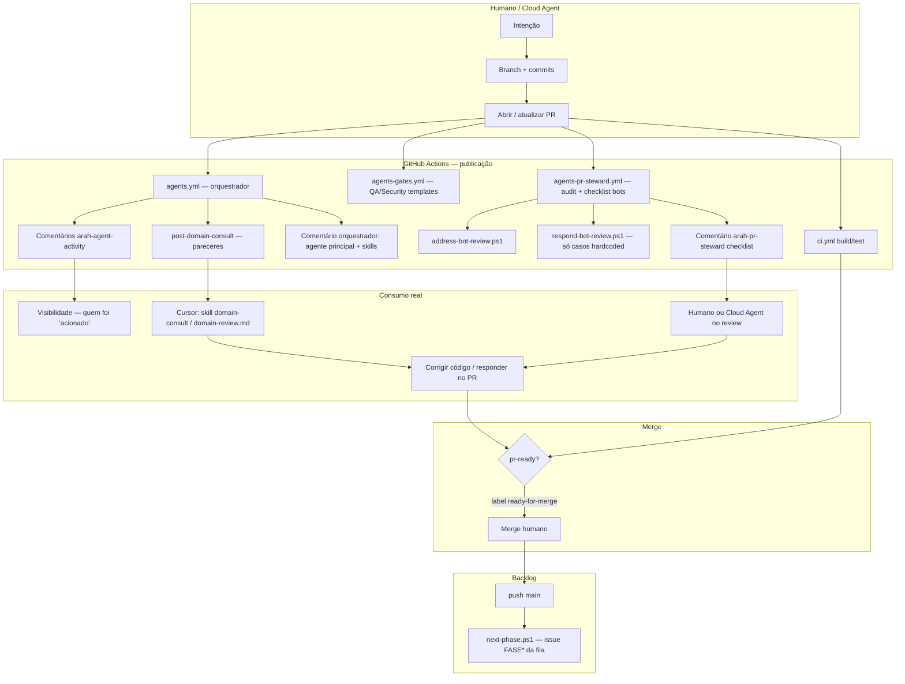

# Integridade do fluxo de agentes no PR

**Versão**: 1.0  
**Data**: 2026-08-15  
**Público**: produto, engenharia, operação por agentes  
**Status**: diagnóstico (observa o que o sistema **faz de verdade** vs o que a UI do PR **parece** fazer)

---

## 1. Resposta curta

| Pergunta | Resposta |
|----------|----------|
| Onde os comentários dos “agentes” são consumidos? | Principalmente por **humano** e por **agente de código** (Cursor/Cloud) que **escolhe** ler o PR / `domain-review.md` / skill `arah-domain-consult`. **Não** há loop automático que marca checklists. |
| O Agent Graph aparece no PR? | **Não.** É artefato gerado (`export-graph` → JSON em `docs/_meta/`). Serve para auditar *roteamento*, não para UI ao vivo “quem está agindo”. |
| Os agentes de domínio “agem”? | No CI eles são **consultivos**: colam parecer + checklist “Validar no PR” a partir do YAML. **Não executam código nem respondem o checklist.** |
| Por que parece que “anotam e não fazem”? | Porque o desenho atual é **passivo por arquivo + comentário** (sem `followup_message` / sem segundo turno de modelo no hook). Publicar ≠ cumprir. |

---

## 2. Fluxo completo (criação → evolução → merge)

### O que cada comentário **é**

| Marcador no PR | Origem | Natureza |
|----------------|--------|----------|
| `arah-orchestrator` | `agents.yml` | Roteamento: agente principal + skills **sugeridas** |
| `arah-agent-activity:*` | `post-agent-activity.ps1` | “Agente X foi acionado” + checklist de **conduta** (guardrails do manifesto) |
| `arah-domain-consult:*` | `post-domain-consult.ps1` | Texto fixo do `enrich`/`validate` do `.agents/domain/*.agent.yaml` + lista de arquivos do diff |
| `arah-qa-gate` / security | `agents-gates.yml` | Template de checklist orientativo |
| `arah-pr-steward` | `agents-pr-steward.yml` | Lembra regra de bots + status do audit |
| CodeRabbit / Bugbot | SaaS externo | Review inline (quando PR não é draft) |
| Resposta `cursor` / humano | Agente de código ou pessoa | **Único** lugar onde checklists costumam ser *respondidos* de fato |

---

## 3. Agent Graph — o que é e como “apresentar”

- **Não** roda no feed do PR.
- Formaliza arestas: path → regra → agente → skill → spec → harness → guardrail → workflow.
- Comandos: `./scripts/agents/arah-agents.ps1 export-graph` / `validate-graph`.
- Artefato: `docs/_meta/agent-graph.generated.json` (+ doc `docs/ops/AGENT_GRAPH.md`).

**Como apresentar “quem age” hoje**

| Canal | O que mostra |
|-------|----------------|
| Comentário orquestrador no PR | Agente principal + co-agentes por path |
| `arah-agent-activity` | Lista de agentes “ativados” naquele evento |
| Artifact do workflow Orchestrate | JSON `agent-activity-*.json` |
| Agent Graph JSON | Mapa estático de *possibilidade* de ativação, não o instante do PR |

**Lacuna de produto**: não há vista única no PR (“grafo desta revisão” + estado cumprido/pendente por item de Validar no PR).

---

## 4. Integridade — onde a cadeia quebra

### 4.1 Publicação sem execução (esperado pelo desenho passivo)

Decisão deliberada (AGENTS.md / comunicação passiva): domínio **não** dispara turnos extras de modelo no CI.  
Consequência: “Validar no PR” chega como **lista de verificação para quem for implementar/revisar**, não como tarefa que o bot fecha sozinho.

### 4.2 `respond-bot-review.ps1` quase não generaliza

Só responde a poucos padrões hardcoded (ex.: arquivos Core antigos).  
Apontamentos CodeRabbit/domínio/steward **não** geram reply automático genérico.

### 4.3 `pr-ready` / contagem de bots é ruidosa

`address-bot-review` trata comentários de `github-actions` (incluindo os **próprios** checklists steward/QA/domínio) como “apontamentos de bot”.  
Isso infla `bot_comments` e dificulta o label automático `ready-for-merge` — mesmo com CI verde e 0 threads inline.

### 4.4 Checklists nunca são “ticados” no GitHub

Os `- [ ]` dos templates **não** são atualizados pelo CI quando alguém cumpre o item.  
A evidência fica em: commits, testes, comentário humano/Cursor (“Resposta aos bots”), ou threads resolvidas.

### 4.5 Visão de domínio ≠ backlog automático

Parecer de `monetizacao-split` / `carteira-arata` / TI **não** abre issues no Project.  
Backlog operacional continua: épicos FASE* + `PHASE_QUEUE` + `next-phase` após merge em `main`.  
Garantir “tudo feito em todos os domínios” hoje = **disciplina DoD** (spec `covered_by`, harness, sync-docs, leitura do parecer) — não um kanban gerado pelos comentários.

### 4.6 Cloud Agent / Cursor

Só “fecha o ciclo” se a sessão **ler** pareceres e responder (como em #469).  
Sem essa etapa, o PR fica com dezenas de notas e zero consumo.

---

## 5. Como *deveria* garantir cobertura (DoD atual vs ideal)

### O que já garante comportamento (quando seguido)

| Mecanismo | Garante |
|-----------|---------|
| Spec + `covered_by` + harness | Critérios de aceite com teste |
| `dotnet test` / CI | Regressão |
| sync-docs | Doc no mesmo PR |
| Domain consult + skill | Lembrete de invariantes de negócio |
| Guardrail `no_merge` | Sem merge automático |

### O que **não** está fechado hoje

| Lacuna | Efeito |
|--------|--------|
| Sem estado “item de domínio cumprido” | Humano não vê progresso no PR |
| Sem issue automática a partir de “Validar no PR” | Visão do agente não vira card |
| Sem grafo do PR na UI | “Quem está agindo” é opaco |
| Auto-reply limitado | Bots parecem ignorados |
| Contagem steward ruidosa | ready-for-merge pouco confiável |

---

## 6. Recomendações de evolução (prioridade)

| Prio | Mudança | Objetivo |
|------|---------|----------|
| P0 | Steward: **não** contar `arah-domain-consult` / `arah-agent-activity` / gates templates como “bot pending”; só CodeRabbit/Bugbot/CodeQL **inline** + falhas CI | Integridade do ready-for-merge |
| P0 | Template de **resposta obrigatória** no open-pr / Cloud Agent: seção “Pareceres endereçados” com IDs de domínio | Consumo explícito |
| P1 | Job que gera comentário `<!-- arah-pr-graph -->` com agentes ativados + link do export-graph filtrado pelos paths do PR | Apresentar o grafo na revisão |
| P1 | Checklist dinâmico: issue/comment com `- [x]` atualizado quando `pr-ready` + evidência de testes dos ACs | Fechar o loop visual |
| P2 | Opcional: abrir subtarefas Project a partir de validate[] **só** quando `kind: enforce` (hoje tudo consultivo) | Visão → backlog sem spam |
| P2 | Expandir `respond-bot-review` ou skill `address-bot-review` com LLM sob gate humano | Resposta real a bots |

---

## 7. Como usar o fluxo *agora* (operação correta)

1. Abrir PR (não draft, se quiser CodeRabbit).  
2. Esperar Orchestrate + Steward + Gates.  
3. **Ler** pareceres de domínio aplicáveis ao diff (ignorar TI se o PR não é TI).  
4. Corrigir código / testes / docs.  
5. Postar **um** comentário consolidado “Resposta aos bots / pareceres” (como #469).  
6. Resolver threads inline.  
7. `pr-ready` / label `ready-for-merge` → merge **humano**.  
8. Após merge: `next-phase` pode abrir a próxima FASE* — isso **não** substitui itens fiscais/domínio sem entrada na `PHASE_QUEUE`.

---

## 8. Conclusão

O sistema está **íntegro no desenho passivo** (publicar parecer + gates + CI), mas **incompleto no fechamento do ciclo**: a UI do PR sugere uma orquestra de agentes trabalhando, quando na prática a maior parte é **sinalização**. Quem “não quer” não é o agente — é a ausência de um **executor** obrigatório dos checklists e de uma **vista de progresso**.

Até as recomendações P0/P1 entrarem, a garantia de “tudo feito em todos” continua sendo: **spec + testes + sync-docs + resposta explícita aos pareceres + merge humano**.

---

### Changelog

- **1.0** (2026-08-15): diagnóstico do fluxo PR ↔ agentes ↔ graph ↔ backlog; lacunas e recomendações.
