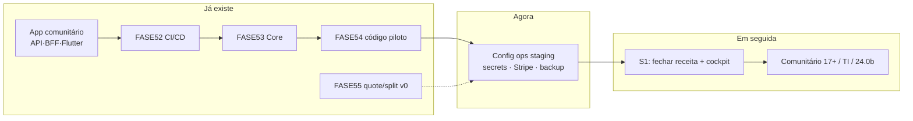
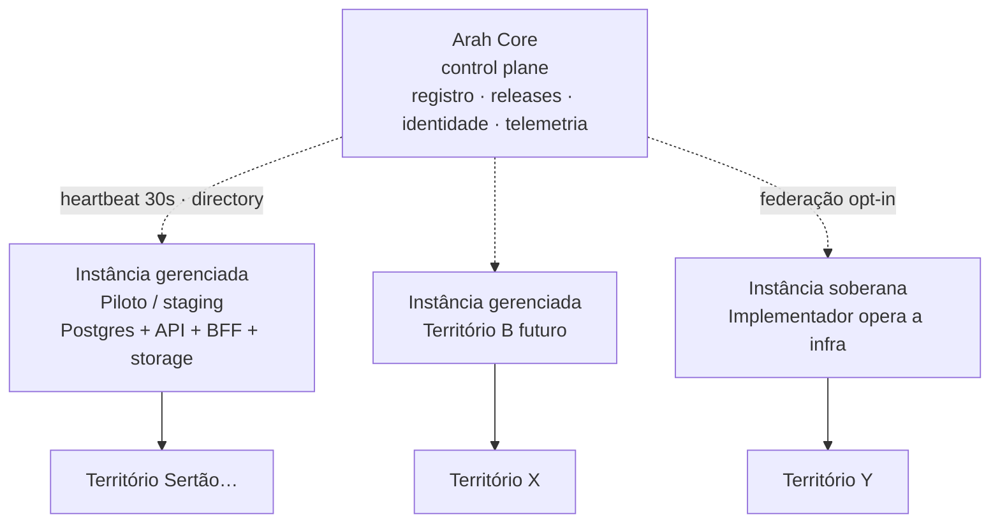

# Canvas executivo — Estado do Arah

**Versão**: 1.0  
**Atualizado**: 2026-08-15  
**Público**: diretoria, produto, ops, investidores internos  
**Fontes**: [PLATFORM_STATE](./PLATFORM_STATE.md) · [STATUS_FASES](../STATUS_FASES.md) · [FEATURE_MATRIX](../FEATURE_MATRIX_API_BFF_APP.md) · [Visão de produto](../product/01_PRODUCT_VISION.md) · [Sustentação](../backlog-api/REALINHAMENTO_SUSTENTACAO_OPERACIONAL.md)

> Documento de **síntese executiva**. Detalhe técnico vive nos links; este canvas responde: *o que é o produto, o que já existe, o que está testado, o que falta, o que são instâncias, e o que vem a seguir*.

---

## 1. Em uma página

| Dimensão | Situação hoje |
|----------|---------------|
| **Produto** | Plataforma comunitária **território-first**: feed, mapa, membership, marketplace, eventos, chat, governança, alertas — **API + BFF + app Flutter alinhados** |
| **Maturidade de código** | Fases comunitárias **1–16** entregues; design app Ondas A–I; ponte hídrica WA-E* + **WA-N1** (NaturalAsset ponto, **API-only**) |
| **Go-live produção** | **Ainda não**. Bloqueio operacional: fechar **FASE54** (secrets staging / Stripe / backup) |
| **Receita** | Modelo **open-core** em código (FASE55 v0: quote, split, gate comercial, refund, payout consolidado); fechamento depende do piloto |
| **Qualidade** | CI bloqueante; meta cobertura **>90%** camadas de negócio; Spec-Driven Design + gates de agentes |
| **Próximo P0** | Config humana FASE54 → fechar épico → continuar FASE55 / S1 (cockpit) + trilhas paralelas (TI, corpos d’água 24.0b) |



---

## 2. O que é o produto (estratégia)

### Norte

**Arah** é uma plataforma operacional de **organização comunitária territorial**: o território físico é a unidade central; presença e vínculo local importam mais que engajamento infinito.

| Princípio | Significa na prática |
|-----------|----------------------|
| Território-first | Entidade `Territory` é geográfica e neutra — sem lógica social embutida |
| Comunidade-first | Visitor → resident; feed + mapa + membership |
| Open-core | Morador **não paga** pelo núcleo; receita vem de comércio (planos + taxa/split) |
| Autonomia local | Implementador local + fundo do território no split; soberania de dados por instância |
| Sem vigilância | Inteligência territorial com revisão humana; sem decisão opaca de IA |

### Estratégia em três camadas

| Camada | Objetivo | Status |
|--------|----------|--------|
| **A. Produto comunitário** | Valor no território (feed, mapa, mercado, governança…) | ✅ MVP+ estável no app |
| **B. Sustentação operacional (52–61)** | Colocar no ar, cobrar, operar multi-instância | 🟡 S0 quase fechada; S1 em curso |
| **C. Diferenciação** | Inteligência territorial, saúde hídrica, economia local avançada | ⏳ Planejado / início pontual |

**Regra de prioridade atual**: sustentação S0–S1 **viabiliza** o piloto; funcionalidades comunitárias 17+ e TI **não competem** com o fechamento do go-live — rodam em paralelo só quando não roubam o P0 de ops/receita.

---

## 3. Estratégia de funcionalidades

### Como decidimos o que entra

1. **Alinhamento vertical** — o que existe na API deve existir no BFF e no app (já alcançado na matriz base).
2. **Onda S0 → S1 → S2…** — infra → receita → transparência → multi-instância → federação → capital.
3. **Trilhas transversais** — TI (World Monitor) e corpos d’água — sem substituir a numeração FASE*.
4. **Spec-before-code** — fases S0+ com `docs/specs/` e `Spec-Id` no PR.

### Mapa de frentes

| Frente | O que entrega | Quando |
|--------|---------------|--------|
| Comunidade no app | Uso diário do território | ✅ Agora |
| Design high-premium | UX/UI (gaps DSG web; app Ondas A–I ✅) | 🟡 Web residual |
| Monetização | Planos Loja/Pro, quote, split, Aratá | 🟡 v0 código; fechar com piloto |
| Cockpit implementador | Operar territórios e receita (web) | ⏳ FASE57 |
| Multi-instância / federação | Vários territórios, soberania, opt-in | ⏳ FASE58–59 |
| Inteligência Territorial | Sinais externos → inbox → publicação | ⏳ TI-0…TI-3 (MVP) |
| Saúde / corpos d’água | Rios, nascentes como ativos curáveis | 🟡 WA-N1 ponto ✅ na API (sem BFF/Flutter); curso 24.0b ⏳ |

---

## 4. O que já está desenvolvido (de fato)

### Superfície do produto (usuário final)

| Capacidade | API | BFF | App | Nota |
|------------|-----|-----|-----|------|
| Auth + onboarding + território | ✅ | ✅ | ✅ | Inclui busca sem GPS |
| Feed + posts + mídia | ✅ | ✅ | ✅ | Detalhe, deep-link do mapa |
| Mapa + pins | ✅ | ✅ | ✅ | Eventos, assets, alertas, posts |
| Membership visitor/resident | ✅ | ✅ | ✅ | Verificação geo |
| Eventos | ✅ | ✅ | ✅ | Criar + participar |
| Marketplace + checkout PIX | ✅ | ✅ | ✅ | Loja, QR, saldo vendedor |
| Chat territorial | ✅ | ✅ | ✅ | Canais / grupos |
| Governança (votações) | ✅ | ✅ | ✅ | |
| Moderação / alertas / conexões | ✅ | ✅ | ✅ | |
| Assets / corpos d’água (ponte TerritoryAsset) | ✅ | ✅ | ✅ | WA-E* — jornada `assets` no BFF/app |
| NaturalAsset ponto (WA-N1) | ✅ | ⏳ | ⏳ | `/natural-assets` só em `Arah.Api`; BFF/Flutter ainda não expõem |

Fonte: [FEATURE_MATRIX_API_BFF_APP.md](../FEATURE_MATRIX_API_BFF_APP.md) · [STABLE_RELEASE_APP_ONBOARDING.md](../STABLE_RELEASE_APP_ONBOARDING.md).

### Plataforma / engenharia

| Bloco | Estado |
|-------|--------|
| Clean Architecture .NET (`Arah.*`) | ✅ |
| BFF por jornadas (Flutter-only) | ✅ |
| CI/CD, GHCR, deploy staging, gate prod | ✅ FASE52 |
| Arah Core (registro, heartbeat, releases, diretório) | ✅ FASE53 |
| Compose piloto + scripts de provisionamento | ✅ código FASE54 |
| Quote / receipt / gate comercial / refund / payout v0 | ✅ FASE55 parcial |
| Operação por agentes (Cursor + CI) | ✅ |

### Design app

Ondas **A–I** (APP-DS-01…17): shell, jornadas, checkout PIX, CRUD/foto produtos, saldo vendedor, QR PIX, stubs “Em breve” — **entregues**.

---

## 5. O que já está testado

| Camada | Prática | Estado |
|--------|---------|--------|
| Unitário / integração .NET | `dotnet test` em CI; cobertura alvo **>90%** negócio | ✅ Pipeline verde em main |
| Spec harness | Specs YAML + `spec-harness` / gates | ✅ Ativo (fases S0+) |
| Agents gates | QA / Security nos PRs | ✅ |
| Flutter / Wiki / Portal | Jobs CI dedicados | ✅ (lint wiki/portal: usar `npm test` + type-check) |
| Staging smoke | Health API+BFF + `verify-pilot-instance` no deploy | 🟡 Código pronto; secrets manuais pendentes |
| PSP Stripe sandbox | `verify-stripe-sandbox.ps1` | ⬜ Aguarda secret ops |
| E2E produção / multi-instância | FASE58 | ⏳ Não iniciado |

**Leitura executiva**: o *produto lógico* está bem coberto por testes automatizados. O *piloto em ambiente real* ainda depende de configuração humana (não de falta de código de verificação).

---

## 6. O que falta em geral

### Bloqueadores de go-live (P0)

| Item | Dono | Doc |
|------|------|-----|
| Secrets staging (`JWT__SIGNINGKEY`, Stripe) | Humano ops | [PILOT_STAGING_CONFIG_TODO.md](./PILOT_STAGING_CONFIG_TODO.md) |
| Fechar issue FASE54 (#389) + meta `completed` | Ops + docs | FASE54 |
| Backup agendado RPO ≤ 15 min em ambiente real | Ops | FASE54 / 58 |

### Receita / operação (S1–S2)

| Item | Fase | Lacuna |
|------|------|--------|
| Alias merchant / wallets / consumption meter | FASE55 | Endpoints ainda ⏳ no doc de fase |
| Transparência pública de taxas | FASE56 | Pendente |
| Cockpit web do implementador | FASE57 | Pendente |
| Ciclo deploy/backup/rollback multi-instância | FASE58 | Pendente |
| Federação entre territórios | FASE59 | Pendente |
| App papel implementador | FASE60 | Pendente |
| Capital territorial | FASE61 | Pendente |

### Produto comunitário avançado (após/paralelo ao piloto)

Compra coletiva, hospedagem, demandas/ofertas, moeda territorial profunda, IA avançada, etc. — fases **17–51** no backlog; **não** são o gargalo atual de go-live.

### Trilhas transversais

| Trilha | Feito | Falta |
|--------|-------|-------|
| Corpos d’água | WA-E1…E4; WA-N1 ponto (API-only) | BFF/Flutter para NaturalAsset; 24.0b LineString; sensibilidade AC-WA-3…5 |
| Inteligência Territorial | Specs/issues TI-0…7 abertas | Execução TI-0 → MVP TI-1…3 |
| Design web | Parte DSG | DSG-04 espaçamento, DSG-06 glass, DSG-07 syntax WCAG |
| DoD retrofit | Parcial | DOD-05…08, DOD-10 |

---

## 7. Instâncias — o que são e por que importam

### Analogia

Pense no Arah como uma **rede de “cidades digitais”**:

- Cada **instância** é o *servidor / stack* que hospeda um ou mais territórios (API, banco, mídia, workers).
- O **Arah Core** é o *cartório / torre de controle*: sabe quais instâncias existem, se estão saudáveis, qual versão rodam — **sem guardar** o feed, o chat ou os dados sociais do território.



### Conceitos-chave

| Termo | Significado |
|-------|-------------|
| **Instância** | Deploy completo da plataforma (código + dados) capaz de servir territórios |
| **Território** | Lugar geográfico neutro *dentro* de uma instância — unidade de comunidade |
| **Core** | Control plane global: registro de instâncias, catálogo de releases, identidade federada (`globalUserId`), agregação de health/ledger |
| **Instância gerenciada** | Infra operada pela plataforma Arah (recomendado para o **piloto**) |
| **Instância soberana** | Infra operada pelo implementador local; pode federar-se depois (FASE59) |
| **Piloto** | 1ª instância gerenciada de verdade — scripts em `infrastructure/pilot/` + verify no deploy staging |

### Estado atual das instâncias

| Aspecto | Hoje |
|---------|------|
| Modelo Core + Instance no código | ✅ FASE53 |
| Compose + scripts piloto | ✅ FASE54 código |
| Registro + heartbeat no CI/staging | ✅ quando secrets/JWT ok |
| Várias instâncias em produção | ❌ Ainda não (FASE58) |
| Federação entre territórios | ❌ FASE59 |
| Config secrets staging / Stripe | ⬜ Humano — **bloqueia fechar FASE54** |

**Por que isso é estratégico**: sem instância piloto estável não há cobrança real, não há SLA, não há cockpit útil. Multi-instância permite *muitos territórios* e *soberania de dados* sem um monólito global de conteúdo.

Detalhe: [FASE53](../backlog-api/FASE53.md) · [FASE54](../backlog-api/FASE54.md) · [FASE58](../backlog-api/FASE58.md) · [Anexo instâncias](../handoff/arquitetura-c4/Anexo%20Handoff%20-%20Operacao%20Instancias%20e%20Federacao.dc.html).

---

## 8. Próximas funcionalidades (pipeline)

### Imediato (esta semana / próximo ciclo humano)

1. **Ops**: completar [PILOT_STAGING_CONFIG_TODO](./PILOT_STAGING_CONFIG_TODO.md) e fechar **FASE54**.
2. **Produto/eng**: fechar remanescentes **FASE55** (wallets / alias merchant / consumption) alinhados ao piloto.
3. **Higiene**: Dependabot PRs abertos (wiki/portal) — `sync-board` falhando; sem threads de review pendentes.

### Curto prazo (S1)

| Entrega | Fase |
|---------|------|
| Transparência de taxas | FASE56 |
| Cockpit implementador (web) | FASE57 |

### Paralelo recomendado (squad distinto)

| Entrega | ID |
|---------|-----|
| Contratos + fixtures World Monitor | TI-0 |
| MVP sinais → inbox → publicação | TI-1…TI-3 |
| Curso d’água (LineString) | FASE24.0b |
| Gaps design web | DSG-04/06/07 |

### Médio prazo (S2–S4)

Operação multi-instância → federação → app implementador → capital territorial (**FASE58–61**).

---

## 9. Canvas visual (Business Model + Delivery)

### Proposta de valor

```text
Moradores          → pertencimento, informação, cuidado coletivo no território
Comércios locais   → loja digital com taxa transparente (não paywall comunitário)
Implementadores    → operação, receita compartilhada, autonomia
Plataforma         → split + planos comerciais (open-core)
```

### Motor de receita (open-core)

| Fonte | Quem paga | Status |
|-------|-----------|--------|
| Plano Loja / Pro | Comércio | ✅ Gate v0 |
| Taxa por transação + split | Embutida no checkout | ✅ Quote/receipt/refund v0 |
| Consumo medido (IA, mídia…) | Comércio / uso avançado | ⏳ |
| Patrocínio / doação / capital | Futuro | ⏳ FASE61 |

### Riscos executivos

| Risco | Mitigação |
|-------|-----------|
| Piloto sem secrets → “código pronto, ar não” | Checklist FASE54 dono humano |
| Expandir comunidade 17+ antes de receita | Prioridade S0/S1 explícita na fila |
| Core como SPOF | Instância autônoma se Core cair (desenho FASE54/58) |
| IA / sinais sem governança | TI: revisão humana obrigatória |

---

## 10. Indicadores rápidos (snapshot 2026-08-15)

| Indicador | Valor |
|-----------|-------|
| Fases comunitárias 1–16 | ✅ Completas |
| Fases sustentação 52–53 | ✅ Completas |
| FASE54 | 🟡 Código ✅ · config ops ⬜ |
| FASE55 | 🟡 Em progresso (ACs v0 cobertos; endpoints extras ⏳) |
| Alinhamento API↔BFF↔App (matriz base) | ✅ |
| PRs feature abertos | 0 (só Dependabot) |
| Última entrega feature | WA-N1 NaturalAsset ponto (#466, 2026-08-10) |
| Go-live produção | ❌ Bloqueado em config FASE54 |

---

## 11. Onde aprofundar

| Pergunta | Documento |
|----------|-----------|
| Operabilidade por nível | [PLATFORM_STATE.md](./PLATFORM_STATE.md) |
| Status de cada fase | [STATUS_FASES.md](../STATUS_FASES.md) |
| Fila machine-readable | [PHASE_QUEUE.yaml](../_meta/PHASE_QUEUE.yaml) |
| O que o app usa | [FEATURE_MATRIX…](../FEATURE_MATRIX_API_BFF_APP.md) |
| Monetização | [FASE55](../backlog-api/FASE55.md) · [Adendo](../handoff/arquitetura-c4/Adendo%20de%20Monetizacao%20-%20Handoff%20Arah.dc.html) |
| TI / World Monitor | [REALINHAMENTO_INTELIGENCIA_TERRITORIAL.md](../backlog-api/REALINHAMENTO_INTELIGENCIA_TERRITORIAL.md) |
| DoD / qualidade | [DEFINITION_OF_DONE.md](../governance/DEFINITION_OF_DONE.md) |

---

### Changelog deste canvas

- **1.0** (2026-08-15): primeira versão executiva — estado do produto, testes, lacunas, instâncias, estratégia e pipeline.
